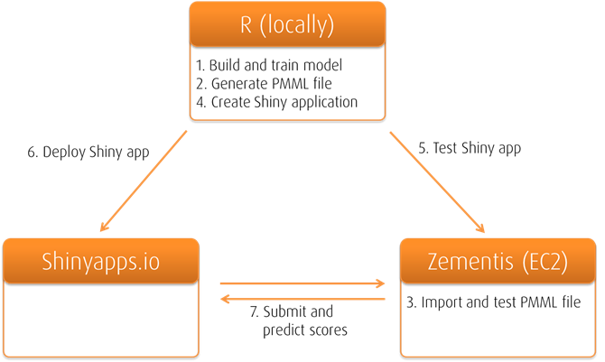

R/Zementis POC

Small project to test how R and Zementis work together. 

We used data from the Framingham heart study to build a logistic regression model
which predicts the risk that a person will suffer from a coronary heart disease 
in the next 10 years. 

The image below summarizes the general architectural setup of the POC and the steps conducted:

The Shiny app can be found on Shinyapps.io [here](https://alexlemm.shinyapps.io/r_zementis_integration/).